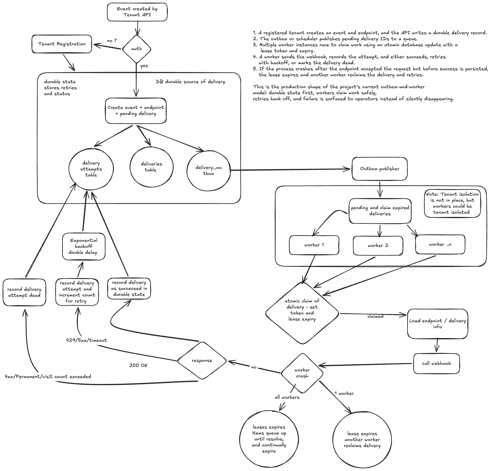

# mgc

`mgc` is a small multi-tenant webhook delivery service. Clients register a
tenant, receive an API key, and submit events with a destination webhook URL.
The service stores each event and delivery in SQLite, records the work in a
durable outbox, and uses an asynchronous worker to send webhooks, retry
temporary failures, and track delivery attempts.

See [error_handling.md](error_handling.md) for details on authentication,
retries, queue failures, abandoned deliveries, and other failure cases.

# Questions
1. The endpoint returns HTTP 200, but your service crashes before recording success. What happens next?

delivery remains claimed, claim_token is set, and claim_expires_at = future timestamp
as such the worker will have not recorded success yet. After the lease expires, another worker can reclaim the delivery and send it again. 
This means the endpoint may receive the same event more than once, even though it already returned 200 this is normal at-least-once delivery behavior.

2. A delivery request times out. Can you know whether the customer received it? How should the system behave?

No, if it times out we do not know if the custmer received it.
- Before the request reached the customer
- While the customer was processing it
- After the customer processed it but before the response reaches my worker
It is recorded a failed deliever, with timeout, and it is returned to pending, and requeued via the outbox. at-least-once delivery behavior is in play, which means
the customer might receive it many times. (5 here)

3. Two workers attempt to claim the same delivery simultaneously. What happens?

The database claim is atomic. the 1st worked sets status claimed, calimed by, token and and expires at
the 2nd fails because the deliver is no longer pending.

4. Would you promise exactly-once webhook delivery to customers? Why or why not?

There are too many variables involved in NW requests to guarantee such a thing.  Network timeouts, process crash, garbage collection, natural disaster,  
malicious actors, and more can all quite easily cause our timeout limites to be exceeded.


5. One endpoint takes 30 seconds for every request. How do you stop it degrading all other customers?

It’s the timeout value for the webhook request: the code creates an httpx.AsyncClient(timeout=REQUEST_TIMEOUT_SECONDS), and REQUEST_TIMEOUT_SECONDS is set to 10.0 seconds. each endpoint
is process separately and does its own outbound request, and the timeout is just a local constant, I could, but make this timeout configurable per endpoint, OR have it be dynamically updated.

6. What is the most important limitation of your two-hour implementation?

No durable Queue. Also there is no rate limiting, no Jitter, and no teanant isolation.  No caching, etc...


## Setup From scratch

Start from the project root and run the setup script:

```bash
./setup.sh
```

Use three terminals for this flow. Leave the API and worker terminals running.

## Tests

Run tests
```bash
.venv/bin/pytest
```
Show coverage
```bash
.venv/bin/pytest --cov=mgc --cov-report=term-missing
```

### 1. Start the API

In terminal 1:

```bash
./run_api.sh
```

The API is now available at `http://127.0.0.1:8000`. You can open the
interactive documentation at `http://127.0.0.1:8000/docs`.

### 2. Register a tenant

In terminal 2, register a tenant and copy the returned `api_key`:

```bash
curl -X POST http://127.0.0.1:8000/tenants \
  -H "Content-Type: application/json" \
  -d '{"name":"Acme"}'
```

Save the key in terminal 2:

```bash
export API_KEY="paste-the-api-key-here"
```

The API key is required for the protected event and delivery routes. Keep it
secret; only its hash is stored in the database.

### 3. Create an event

The endpoint is included in the event request. The API creates or reuses that
endpoint, creates the event, and creates a pending delivery in one transaction:

```bash
curl -X POST http://127.0.0.1:8000/events \
  -H "Authorization: Bearer $API_KEY" \
  -H "Content-Type: application/json" \
  -d '{
    "event_type": "test.event",
    "payload": {
      "message": "hello"
    },
    "endpoint": {
      "url": "https://postman-echo.com/post",
      "method": "POST"
    }
  }'
```

The response contains the event ID and delivery ID. The delivery is now in the
SQLite outbox and ready to be consumed.

### 4. Start the worker

In terminal 3, run:

```bash
.venv/bin/python -m mgc.main
```

The worker starts the outbox publisher and queue consumers. It publishes the
delivery ID to the queue, claims the delivery, sends the webhook, and records
the result in SQLite. You should see logs in the terminal and in `worker.log`.

Stop the worker with `Ctrl+C`. Pending or retryable deliveries remain in the
database and can be consumed when the worker starts again.

## Schema

Seven tables, created by the migrations in `src/mgc/migrations/`:

- **tenants** — tenants that own API keys and webhook data
- **api_keys** — hashed bearer API keys used to authenticate tenants
- **events** — `id, tenant_id, event_type, payload, created_at`
- **endpoints** — `id, tenant_id, url, enabled`
- **deliveries** — `id, event_id, endpoint_id, tenant_id, status, attempt_count, next_attempt_at, claimed_by, claim_token, claim_expires_at, created_at, updated_at`
- **delivery_attempts** — `id, delivery_id, attempt_number, worker_id, claim_token, started_at, finished_at, outcome, http_status, error`
- **delivery_outbox** — `id, delivery_id, created_at, published_at, attempt_count, next_attempt_at, last_error`


## Project layout

```
src/mgc/
  db.py              connection + migration runner
  models.py          plain dataclasses (Tenant, APIKey, Event, Endpoint, Delivery, DeliveryAttempt)
  main.py            CLI entry point
  app.py             FastAPI application and HTTP endpoints
  webhook_visitor.py HTTP webhook visitor and response handling
  worker.py          delivery queue consumer and retry handling
  outbox_publisher.py durable outbox publisher
  migrations/        numbered database migrations
  repositories/      database access repositories
    api_keys.py
    deliveries.py
    delivery_attempts.py
    endpoints.py
    events.py
    outbox.py
    tenants.py
scripts/
  init_db.py         create/migrate the database
  seed_data.py       generate tenants, API keys, events, and deliveries
setup.sh              development environment and database setup
run_api.sh            start the FastAPI server
tests/
  conftest.py         shared isolated database fixture
  unit/               repository, visitor, and outbox tests
  integration/        API, migration, and worker tests
```

## Seed test data

Create 10 tenants, 510 events, and 510 pending deliveries (51 of each per
tenant) with one command. Existing fixture data is cleared first; the schema
and migration history are kept:

```bash
./scripts/seed_data.py
```

The script creates one sample webhook endpoint per tenant, prints each
generated tenant ID and API key, and writes the same credentials to
`scripts/seed_credentials.json`. That file is ignored by Git because it
contains plaintext fixture keys. The script does not use the API or start the worker.

## Inspect the API

List the authenticated tenant's endpoints:

```bash
curl "http://127.0.0.1:8000/endpoints" \
  -H "Authorization: Bearer $API_KEY"
```

Get a delivery and its attempt history using a returned delivery ID:

```bash
curl "http://127.0.0.1:8000/deliveries/DELIVERY_ID" \
  -H "Authorization: Bearer $API_KEY"
```

Requests without a valid API key receive `401 Unauthorized`. A tenant can
only see its own endpoints and deliveries.

## Reset the database

To wipe everything, delete the database file (for example, `rm mgc.db`) and
run `python scripts/init_db.py` again. This permanently deletes all tenants,
API keys, events, endpoints, deliveries, and attempts.


## payloads

Below is a lost of payloads you can play uised for `/events`

Success 
```json
{
  "event_type": "test.event",
  "payload": {
    "message": "hello"
  },
  "endpoint": {
    "url": "https://postman-echo.com/post",
    "method": "POST"
  }
}
```

503
```json
{
  "event_type": "test.event",
  "payload": {
    "message": "hello"
  },
  "endpoint": {
    "url": "https://httpbin.org/post",
    "method": "POST"
  }
}
```

400 insta dead
```json
{
  "event_type": "string",
  "payload": {
    "additionalProp1": {}
  },
  "endpoint": {
    "url": "https://monzo.com/",
    "method": "GET"
  }
}
```

201 success
```json
{
  "event_type": "test.created",
  "payload": {
    "message": "created"
  },
  "endpoint": {
    "url": "https://httpbin.org/status/201",
    "method": "POST"
  }
}
```

204 success with no response body
```json
{
  "event_type": "test.no_content",
  "payload": {
    "message": "no content"
  },
  "endpoint": {
    "url": "https://httpbin.org/status/204",
    "method": "POST"
  }
}
```

401 insta dead
```json
{
  "event_type": "test.unauthorized",
  "payload": {
    "message": "unauthorized"
  },
  "endpoint": {
    "url": "https://httpbin.org/status/401",
    "method": "POST"
  }
}
```

404 insta dead
```json
{
  "event_type": "test.not_found",
  "payload": {
    "message": "not found"
  },
  "endpoint": {
    "url": "https://httpbin.org/status/404",
    "method": "POST"
  }
}
```

429 retryable
```json
{
  "event_type": "test.rate_limited",
  "payload": {
    "message": "try again later"
  },
  "endpoint": {
    "url": "https://httpbin.org/status/429",
    "method": "POST"
  }
}
```

500 retryable
```json
{
  "event_type": "test.server_error",
  "payload": {
    "message": "server error"
  },
  "endpoint": {
    "url": "https://httpbin.org/status/500",
    "method": "POST"
  }
}
```

502 retryable
```json
{
  "event_type": "test.bad_gateway",
  "payload": {
    "message": "bad gateway"
  },
  "endpoint": {
    "url": "https://httpbin.org/status/502",
    "method": "POST"
  }
}
```

## System design



# AI usage and approach

Throughout, the pattern was the same: I decided what the system should do and how it should be structured, then used AI to produce the mechanical parts faster than I could type them. The repository classes, the migration files, the FastAPI request/response models  all of that is boilerplate where the shape is obvious once you've decided on the schema, and where writing it by hand is tedious.

Where it needed supervision was anything involving judgement about correctness. I elected technology choices, i knew ahead of time i wanted 
fast API with pydantic models, an asyncio queue to account for the IO bound nature of the work, 
The first pass at the API had no authentication at all, so tenant API keys were something I had to identify and ask for. 
Similarly, the transactional behaviour needed my direction: the outbox pattern, and the split between committing and non-committing repository methods so that an event, its delivery, and its outbox row land atomically, came from me understanding the failure modesn not from the model volunteering them. Left alone it produced code that worked on the happy path but quiely lost data on the unhappy one.

Delivery durability (0009). This was the biggest correction. The original code committed the event, then dispatched the webhook — so a crash between the two lost the delivery entirely, and a failure after dispatch could double-send. I introduced the outbox pattern: 0009_create_delivery_outbox.sql, with the outbox row written in the same transaction as the delivery. That's what forced the create / create_uncommitted split across the repositories. 

I also had to add in the checks and measures re url visitation, backoffs, timeouts, and i also gave it the notion of transient errors,
ie. errors taht could be try vs insta dead ones.

I also used it for docs, once I had the project finished I asked to scan it and write docs detailing all of teh error handling I'd thought of.  I then edited the doc it created.

